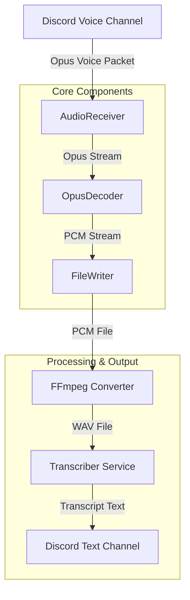

# Sistem Mimarisi

`discord-recorder`, event-driven (olay güdümlü) bir mimariye sahiptir ve Discord ağ geçidi (gateway) olaylarını dinleyerek çalışır.

## Mimari Desen

Sistem, **Pipeline** ve **Service-Oriented** yapıların bir hibritidir. Ses verisi bir uçtan (Discord Voice) girer, bir dizi işlemden geçer (Pipeline) ve sonuç (Metin) bir servis (Discord Text) üzerinden çıktı olarak verilir.

## Veri Akış Diyagramı

## Temel Bileşenler ve İlişkiler

### 1. Bot Client & Interaction Layer
Kullanıcı komutlarını (`/record`, `/stop`) karşılar ve ilgili süreçleri tetikler. `RecordingSession` yönetimini üstlenir.

### 2. Audio Capture Layer (Recorder)
Discord'un ses sunucularından gelen UDP paketlerini yakalar. Her konuşan kullanıcı için ayrı bir stream (akış) oluşturur.
- **Dependency:** `@discordjs/voice`

### 3. Audio Processing Layer
Ham Opus paketlerini işlenebilir ses formatlarına dönüştürür.
- **Süreç:** Opus Packet -> Ogg/Opus veya PCM -> WAV
- **Dependency:** `prism-media`, `mic`, `ffmpeg`

### 4. Transcription Layer (Service)
İşlenmiş ses dosyalarını metne dönüştürür.
- **Modlar:** 
    - **Cloud:** Deepgram API'ye HTTP isteği atar.
    - **Local:** Yerel WhisperX process'ini çalıştırır.

## Kritik Tasarım Kararları

- **Kullanıcı Bazlı Kayıt:** Her kullanıcının sesi ayrı ayrı işlenir, bu da konuşmaların karışmasını önler ve konuşmacı ayrımını (diarization) kolaylaştırır (veya gereksiz kılar).
- **Geçici Dosya Yönetimi:** İşlenen ses dosyaları işlem bitince silinir, disk kullanımı optimize edilir.
- **Hibrit Transkripsiyon:** Hem API tabanlı (hızlı, paralı) hem de yerel (ücretsiz, donanım bağımlı) çözüm sunarak esneklik sağlanmıştır.
